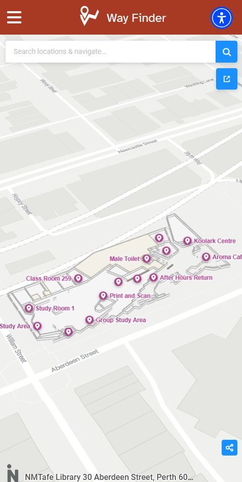

# Way-Finder-App

The Library Wayfinder App is an intuitive and interactive navigation tool designed to enhance user experience in large library spaces. This app provides seamless indoor navigation, helping users locate books, study rooms, amenities, and other library resources with precision and ease.

The Application Implemented using Wordpress Content Management System.

**Application Screenshot:**

